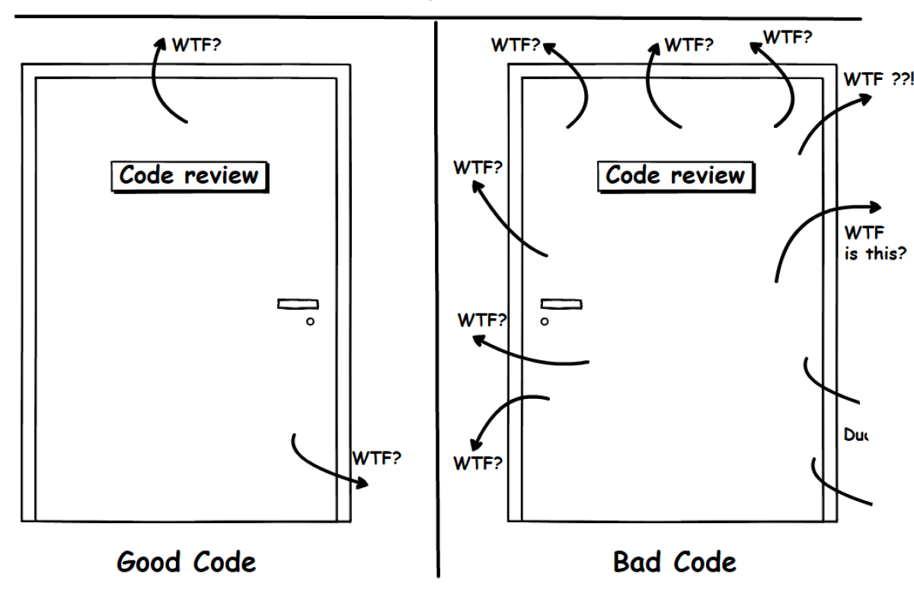

# Naming

Naming is an intricate art, with the distinction between a good name and a great name being subjective and blurry. It is particularly evident when we encounter different options for naming a function responsible for applying CSS styles to a button. Let's explore some of these options and the considerations involved:

1. `styleButton`: This name indicates that the function is specifically related to styling a button. It is concise and communicates the function's purpose effectively.

2. `setStyleOfButton`: This name emphasizes the action of setting the style of the button. It provides clarity but might be slightly verbose.

3. `setButtonCSS`: This name suggests that the function sets the CSS properties of the button. It is straightforward and aligns with common CSS terminology.

4. `stylizeButton`: This name highlights the idea of giving the button a specific style. It adds a touch of creativity and might be suitable in certain contexts.

5. `setButtonStyles`: Similar to `setStyleOfButton`, this name conveys the action of setting styles but in a more concise manner.

6. `applyButtonCSS`: This name implies applying a predefined CSS style to the button. It aligns with the concept of applying styles and might be suitable if the function operates on pre-defined styles.

The choice between these names can vary depending on personal preferences, the programming language used, and the specific project requirements. However, when striving for clean and effective naming, we should consider three key attributes:

1. Purpose: A good name should clearly convey the function's intended use and behavior. It should indicate what the function does and how it relates to the broader context.

2. Concept: A good name captures the fundamental idea behind the function. It should aid in understanding the purpose and functionality of the function, making it easier to reason about and maintain.

3. Contract: A good name establishes expectations about how the function operates. It should convey any limitations, side effects, or dependencies the function might have.

While these attributes don't encompass all aspects of naming, they provide a solid foundation for choosing clear and meaningful names. In the subsequent sections, we explore the significance of each characteristic in more detail and provide additional guidelines for effective naming.
